# World Happiness Data Analizi ve Görselleştirme

**Data seti içerisinde yıllara göre bölgelerin mutluluk skorlaması gösterilmiştir.**

  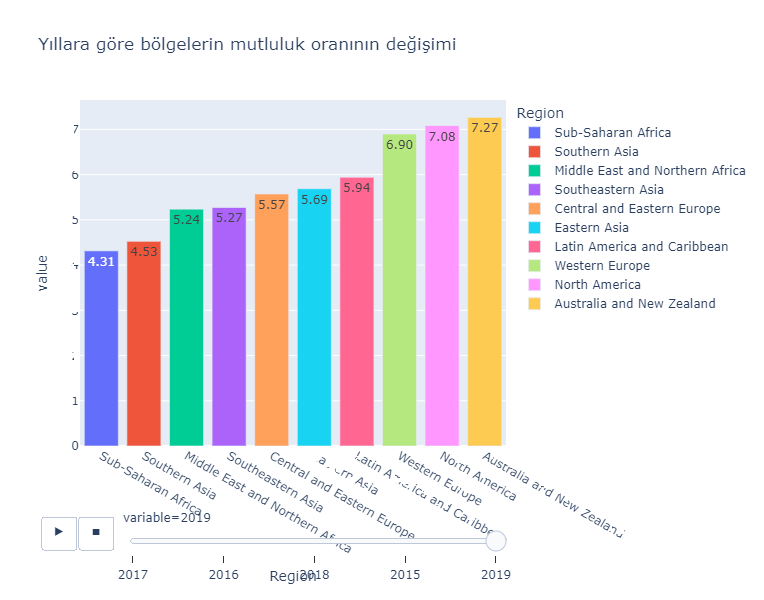

**Yıllara göre değişen mutluluk skorlamasında mutluluğu en çok etkileyen faktörlerin gösterimi yapılmıştır.**

  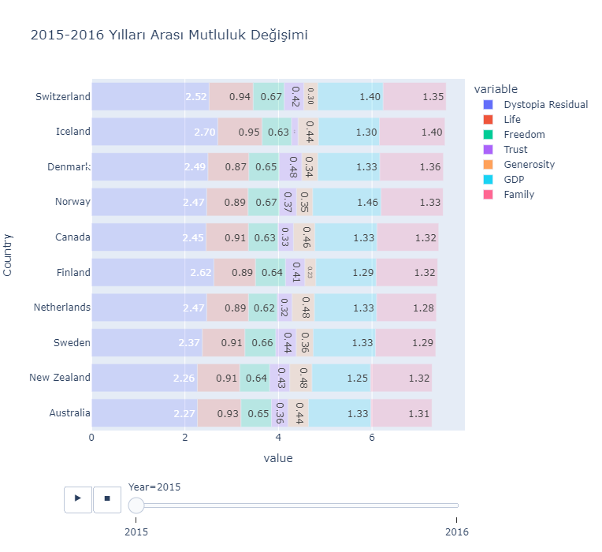

 

**Tüm yılları kapsayacak şekilde ülkeler arasında en mutlu ülkelerin sıralaması yapılmıştır.**

  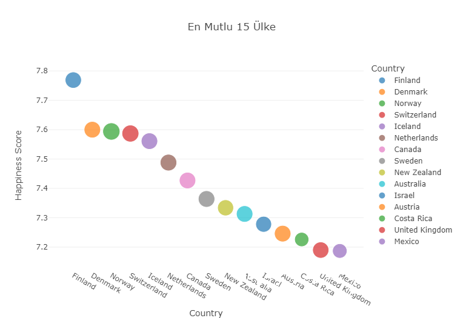

 

**Değişkenler arası korelasyona bakılarak burada mutluluğu en çok etkileyen özniteliklerin karşılaştırılması yapılmıştır.**

  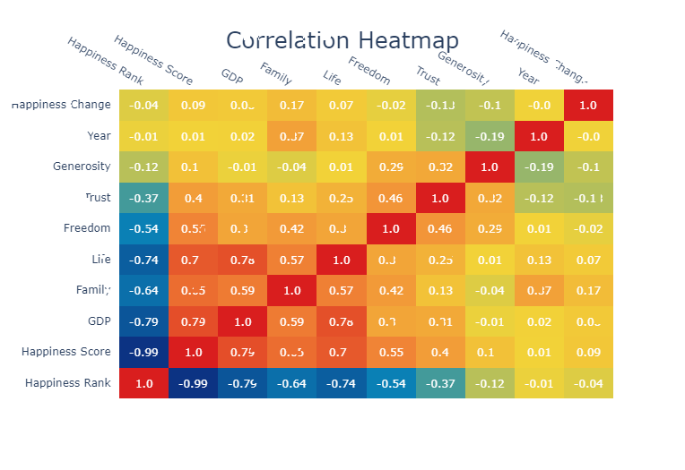

 

**Öznitelikler arasında en yüksek skorlara sahip ülkelerin gösterimi yapılmıştır.**

  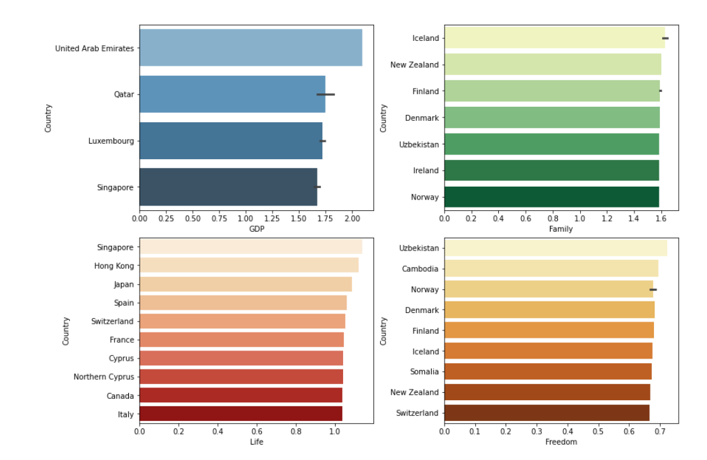

 

**Bölgeler ve Ülkeler düzeyinde mutluluk skorlaması görselleştirilmesi yapılıp yüksek ve düşük olarak sıralandırılmıştır.**

  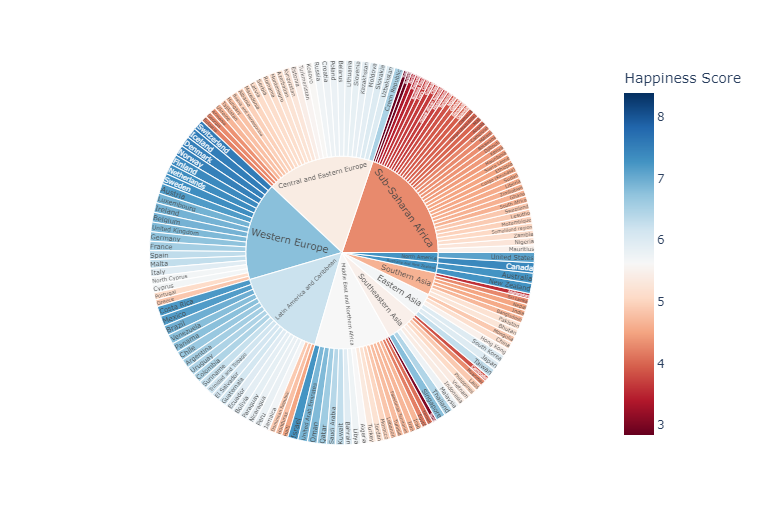

  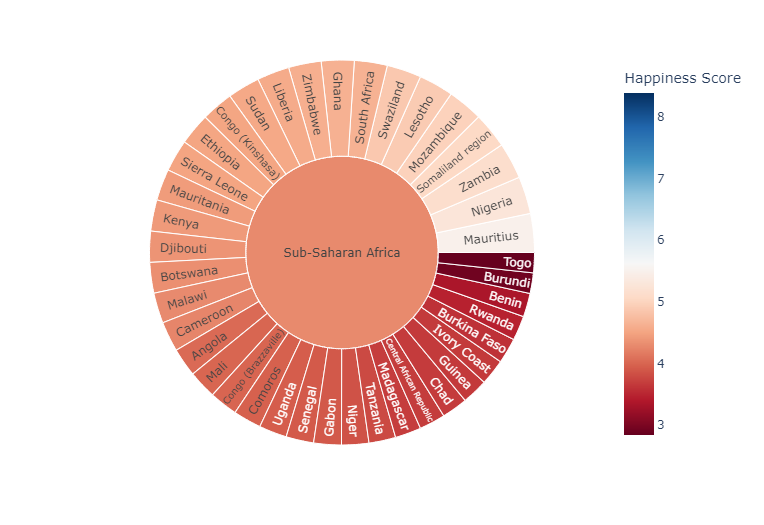

 

**Ülkeler arasında  GPD ve Mutluluk skoru özniteliklerine bakılarak 3 farklı clustering(Düşük,Orta,Yüksek) yapılmıştır.**

  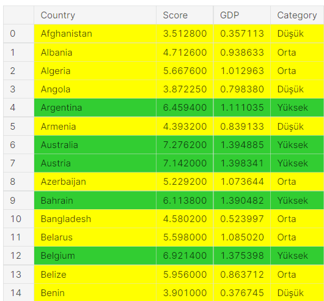

 

**Türkiye ve çevresinde ki ülkeler arasında öznitelik karşılaştırılması yapılmıştır.**

  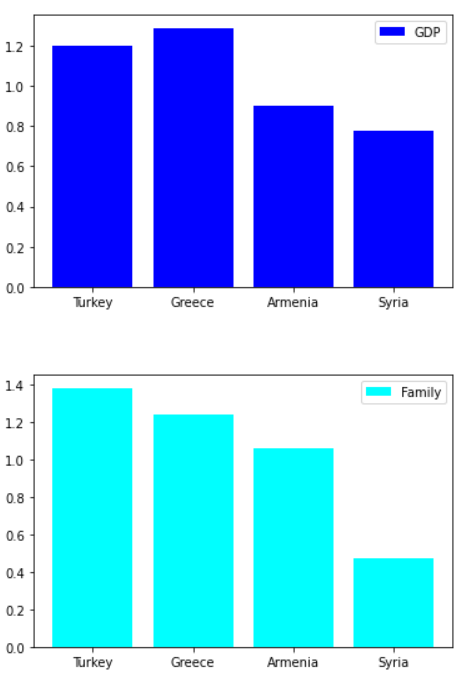

  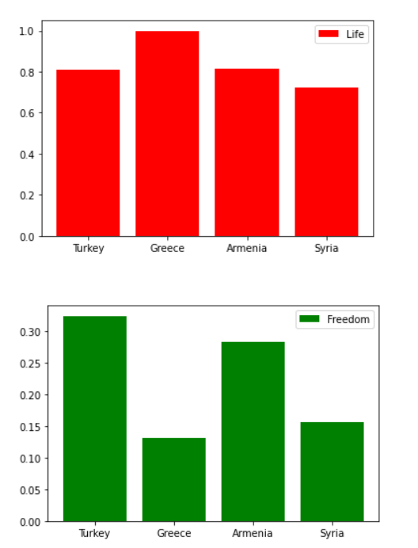

 

**Ülkeler arasında mutluluk skoru özniteliğinin sıçrama ve ani düşüş yaşamaları karşılaştırılması yapılmıştır.**
 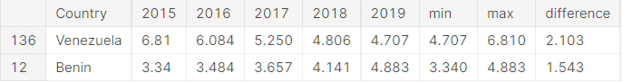

 

**Data seti içerisinde mutluluk skor tahminlemesi gerçekleştirmek için Regression modelleri kurulmuştur, en yüksek skora XGBoost modeli ulaştılmıştır. Oluşturulan model içerisinde model en çok pozitif ve negatif yönde besleyen özniteliklerin karşılaştırılması shap kütüphanesi ile sağlanmıştır.**

  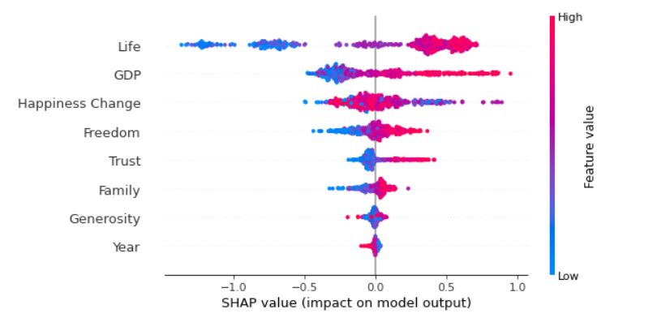

 
